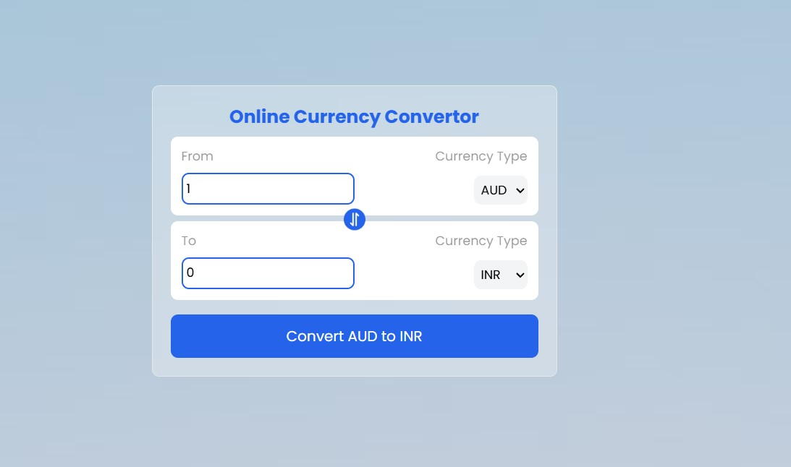

# 💱 Online Currency Converter

Welcome to your instant currency conversion tool – convert between global currencies in real-time with just a few clicks!
Whether you're planning a trip, managing business, or just curious, this app has you covered.

---

<!-- Project Link -->

🚀 **Try it now:** [Convert your currency instantly!](https://online-currency-convertor.vercel.app/)

<!-- Project Image -->

<p align="center">
  
</p>

---

A simple and customizable Online Currency Convertor built with **React** and **Vite**.

## ✨ Features

- 🌍 **Global Support:** Convert between 150+ world currencies

- ⚡ **Real-Time Rates:** Always up-to-date with the latest exchange rates

- 🔄 **Easy Conversion:** Swap currencies instantly

- 📱 **Responsive:** Works smoothly on mobile, tablet, and desktop

- 📋 **Convenient:** Copy results to clipboard with one click

## 🚀 Getting Started

### Installation

1. **Clone the repository:**
   ```bash
   git clone https://github.com/your-username/online-currency-converter.git
   cd online-currency-converter

   ```

2. **Install dependencies:**
   ```bash
   npm install
   ```

### Running the App

Start the development server:
```bash
npm run dev
```
Open [http://localhost:5173](http://localhost:5173) in your browser to get started!

### Building for Production

```bash
npm run build
```

## 📝 Usage

1. Select your base currency (e.g., USD).

2. Select the target currency (e.g., EUR).

3. Enter the amount to convert.

4. Instantly view the converted value with real-time   rates.

## 🔑 API Setup

This project fetches real-time exchange rates from Frankfurter API (a free, no-authentication service).

API Base URL:

"https://api.frankfurter.app/latest?from=${from}"

## 🎨 Customization

- Change the default currencies in the source code.

- Update the API endpoint for different exchange rate providers.

- Style the UI to match your own theme.

## 📄 License

This project is licensed under the MIT License.

---
